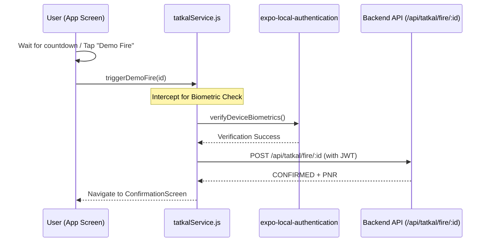

# Biometric Verification & Architecture Hold

## Status: ON HOLD — DO NOT IMPLEMENT

---

## 1. Objective & Concept

To prevent automated bot scripts, mass-booking macros, and scalping tools from hijacking the Tatkal booking system, a biometric check (Face ID, Touch ID, or Device Passcode) was envisioned to be successfully verified on the user's device immediately before a pre-filled booking is "fired" to the booking queue.

This enforces the **Account Holder Mandate** at the physical device level.

### Proposed Architecture & Flow

---

## 2. Mock Implementation (Current Setup)

For the initial build, a mock biometric verification check is implemented:

- **React Native SDK Choice**: `expo-local-authentication`
- **Frontend Interceptor**: Centralized in `tatkalService.js` under [verifyBiometricsPlaceholder()](file:///c:/Coding_files/Competitions/FarAway2026/RailSaathi/apps/mobile/src/screens/tatkal/services/tatkalService.js#L26-L32), which prints debug logs, simulates a 500ms delay, and resolves to `true`.
- **Fallback Design**: If biometrics are not enrolled or fail, the system falls back to the device's secure passcode. If both are disabled, it defaults to a secure PIN or manual CAPTCHA entry.

---

## 3. Why Travel-Time Biometrics was Paused (Rationale)

- **Hardware Failure Risk at Stations**: If a fingerprint scanner malfunctions, gives a false negative, or loses power at a railway platform, a legitimate passenger with a valid ticket would be denied boarding. This outcome is worse than the tout problem we are solving.
- **High Fraud Surface**: Spoofed fingerprint overlays (silicone casts, conductive ink), device tampering, and relay attacks make travel-time biometric verification unreliable without enterprise-grade anti-spoof hardware — which Indian railway platforms do not have.
- **Government Approval Dependency**: UIDAI Aadhaar eKYC API integration requires formal approval from the Unique Identification Authority of India. This is a multi-month process involving legal agreements, security audits, and compliance documentation.
- **Out of Scope for a 6-day Hackathon**: Even if approvals existed, integrating hardware SDKs, testing across 50+ Android/iOS device models, and handling edge cases (wet fingers, cuts, elderly passengers with worn prints) is not feasible in the build timeline.

---

## 4. Current Anti-Tout System (Current Non-Biometric Approach)

Our three-layer anti-tout system achieves the core objective without biometric risk:

1. **Account Holder Mandate**: The account holder's name (from the `users` table) must appear in the passenger list. Comparison is case-insensitive and trimmed. Enforced at the API level before any booking is accepted.
2. **Journey Overlap Lock**: When a booking reaches CONFIRMED status, all passengers on that PNR who have RailSaathi accounts are locked for the full travel duration (departure → arrival). They cannot book another Tatkal ticket with an overlapping time window. This prevents a single identity from being used across multiple simultaneous journeys.
3. **Anti-Hoarding DB Constraint**: A unique index on `(user_id, booking_date)` plus an API-level duplicate check ensures one Tatkal request per user per booking window. This stops bulk booking by touts.

Together, these three mechanisms block the primary tout strategies (identity reuse, bulk booking, proxy travel) without requiring any hardware at the platform.

---

## 5. Production Path (If Biometric is Revisited)

If biometric verification is revisited post-hackathon, the approved approach is **UIDAI eKYC at account creation time only — NOT at travel time.**

1. During RailSaathi account signup, the user completes a one-time Aadhaar eKYC verification via the UIDAI API.
2. This links their verified identity to their RailSaathi account permanently.
3. At booking time, the system checks the verified identity flag — no hardware scan needed.
4. At travel time, the existing PNR + ID check (which Indian Railways already performs) is sufficient.

This approach eliminates the platform-failure risk entirely because:
- Verification happens once, in a controlled environment (user's own phone)
- No hardware dependency at stations
- No real-time API call during boarding

**UIDAI eKYC API Application**: [Resident Aadhaar eKYC](https://resident.uidai.gov.in/eKYC)

---

## 6. Files to Touch When This is Unblocked

> ⚠️ **DO NOT modify these files for biometric until the hold is formally lifted.**

| File | Change |
|---|---|
| [tatkal-service.js](file:///c:/Coding_files/Competitions/FarAway2026/RailSaathi/services/api/src/services/tatkal-service.js) | Uncomment `verifyBiometric()` stub, implement UIDAI eKYC call |
| [tatkal.js](file:///c:/Coding_files/Competitions/FarAway2026/RailSaathi/services/api/src/routes/tatkal.js) | Add biometric verification step in prefill flow |
| [PreFillFormScreen.js](file:///c:/Coding_files/Competitions/FarAway2026/RailSaathi/apps/mobile/src/screens/tatkal/PreFillFormScreen.js) | Add biometric verification step UI (eKYC redirect) |
| `supabase/migrations/` | Add `biometric_verified` boolean column to `users` table |

---

*Document updated: 2026-06-12*
*Author: Member 3 & Member 2*
