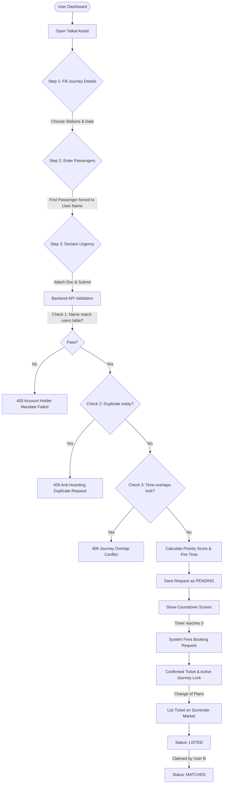
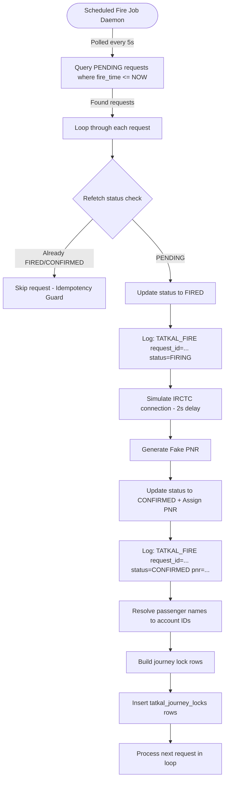

# Tatkal Verified Booking Ecosystem — End-to-End Workflows

This document details the operational flows of the Tatkal booking module in the RailSaathi platform, showing both the **User (Passenger) Perspective** and the **System/Admin Perspective** (daemon jobs, validation engines, and reallocation matching).

---

## 👤 1. User (Passenger) Workflow

The user workflow details the lifecycle of a passenger booking a ticket under the anti-hoarding rules and utilizing the ticket surrender reallocation market.

### A. Pre-Fill & Verification Phase
1. **Login & Profile**: User logs in and must complete profile setup (so name is verified and linked to user ID).
2. **Pre-Fill Submission**: User accesses the **Tatkal Assist** screen on the mobile app.
3. **Validation**:
   * **Account Holder check**: The app automatically adds the user's name as Passenger 1 and disables modification to prevent tout spoofing.
   * **Anti-Hoarding check**: User cannot submit more than one pre-fill per train on a specific booking date (aligned with official IRCTC multi-booking rules).
   * **Journey Overlap check**: System checks if any confirmed journeys exist in `tatkal_journey_locks` overlapping with the new train's travel window.
4. **Urgency Declaration**: User specifies trip reason (medical, bereavement, etc.) and attaches document. System estimates priority score (1-10).
5. **Saved State**: Request is stored in database as `PENDING` with a `scheduled_fire_time` (AC: 10:00 AM, Non-AC: 11:00 AM local time).

### B. Countdown & Booking Phase
1. **Countdown**: App displays live timer counting down to the firing time.
2. **Booking Firing**: At the target time, the system submits the pre-fill request.
3. **PNR Issued**: On success, status changes to `CONFIRMED`, and a simulated PNR is issued.
4. **Lock Activation**: Immediately, journey locks are created for the account holder and all RailSaathi passengers on that booking window.

### C. Surrender Market Phase
1. **Ticket Surrender**: User lists their confirmed PNR for surrender in the reallocation market.
2. **List Ticket**: Listing goes to `LISTED` status.
3. **Market Search**: A different user (User B) searches for available surrendered tickets matching their journey.
4. **Reallocation Match**: User B claims the ticket. The listing transitions to `MATCHED`. User B is assigned the ticket, and the system registers the swap.

---

### User Flow Diagram

---

## ⚙️ 2. System / Admin Workflow

This workflow represents the backend operations, demonstrating the background daemon, prioritizations, locks creation, and transaction safety.

### A. Polling Daemon (Fire Job)
1. **Trigger Interval**: Runs continuously in the background (every 5-30 seconds).
2. **Retrieve Due Requests**: Queries Supabase for requests where `status = 'PENDING'` and `scheduled_fire_time <= NOW()`.
3. **Idempotency Check**: Re-queries each selected row inside a transaction to ensure it has not been processed.
4. **Simulated Firing Sequence**: Logs `FIRING` state, executes simulated payment/booking connection (2-second delay).
5. **PNR Assignment**: Generates unique PNR, updates record to `CONFIRMED`.
6. **Journey Locking**: Resolves passenger accounts and inserts `tatkal_journey_locks` rows.

### B. Surrender Reallocation Match Safety
1. **Self-Request Check**: Validates that requester ID != listing owner ID.
2. **Lock-State Change**: Uses row-level checks to transition status from `LISTED` to `MATCHED` in one atomic operation.

---

### System Flow Diagram

